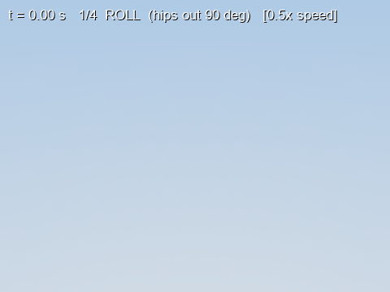

# DOG5

A 5.8 kg quadruped built and brought up from scratch over roughly two months —
twelve CAN servos, one IMU, a MuJoCo model, and a control stack that goes from
"does the bus answer" to a torque-mode trot.

This repository is organised as **seven chapters**, in the order the work
actually happened. Each chapter has a document that states what was achieved,
what the measured numbers were, and — in the same detail — what does not work
and why.



---

## Chapters

| # | chapter | claim | status | source |
|---|---|---|---|---|
| 1 | [Motor library](docs/ch1_motor_library.md) | 12 motors on one CAN bus at 250 Hz **per motor**, recovery with no power cycle | **PASSED** | `src/motor/`, `src/bringup/` |
| 2 | [IMU sensor](docs/ch2_imu_sensor.md) | ~200 Hz, 0 CRC errors, 0.01–0.03° jitter under motor load | **PASSED** | `src/IMU_sensor/` |
| 3 | [Kinematics & calibration](docs/ch3_kinematics_and_calibration.md) | NumPy FK/Jacobian agree with MuJoCo to 1.665e-16 m | **PASSED** | `src/dog5_description/`, `src/calibration/` |
| 4 | [Position stand & crawl](docs/ch4_position_stand_and_crawl.md) | 3-leg stand hold on all four legs; autonomous crawl, 40 mm steps | **PASSED** | `src/position_stand_crawl/`, `src/robot_base/` |
| 5 | [IMU closed-loop stand](docs/ch5_imu_closed_loop_stand.md) | EKF-driven height and attitude trim, still position mode | **PASSED** | `src/imu_closedloop_stand/`, `src/state_estimator/` |
| 6 | [Quasi-dynamic control](docs/ch6_quasi_dynamic_control.md) | Torque stand works; trot and walk drift | **PARTIAL** | `src/torque_stand/`, `src/dog5_trot_quasi_static_model/` |
| 7 | [Convex MPC](docs/ch7_convex_mpc.md) | Ported, runs, unvalidated | **OPEN** | `src/srb_mpc_hw/` |

A one-page version for a talk: **[docs/SUMMARY.md](docs/SUMMARY.md)**.

## Quickstart — no robot needed

```bash
git clone <this repo> && cd dog5
pip install -r requirements.txt

python3 src/selftest/test_all.py                      # 504 gates, 14 suites, ~2-3 min
python3 src/state_estimator/test_estimator.py         # EKF acceptance gates C1-C7
python3 src/dog5_description/check_dog5_kinematics.py # NumPy vs MuJoCo, 1024 poses
python3 src/ekf_closeout/test_closeout.py             # estimator health + replay gates
```

All four run with no hardware, no CAN interface and no experiment data. They
are the fastest way to see what the project actually verifies about itself.

To look at the robot:

```bash
python3 src/dog5_description/view_dog5.py             # MuJoCo viewer
```

## Repository map

```
src/
  dog5_paths.py          the ONLY sys.path logic in the repo
  motor/                 ch1  motorbus, motor_library, motor_gains, mac_can
  motor_demos/           ch1  single-motor teaching scripts
  bringup/               ch1  the T1-T8 CAN bring-up ladder
  IMU_sensor/            ch2  DETA10 driver, frame test, noise logger
  dog5_description/      ch3  dog5.xml, meshes, NumPy kinematics, MuJoCo cross-check
  calibration/           ch3  zeroing and pose capture
  robot_base/            SHARED hardware layer used by ch4/5/6
  position_stand_crawl/  ch4  stand3, crawl, CoM-shift demos
  state_estimator/       ch5  Bloesch error-state EKF + read-only worker
  ekf_closeout/          ch5  health fix, replay, tape-measure validation
  imu_closedloop_stand/  ch5  stages 1 / 2 / 2b / 3 + stand_params
  torque_primitives/     ch6  statics, stance law, torque calibration
  torque_stand/          ch6  wrench -> GRF -> joint torque, the torque stand
  dog5_trot_quasi_static_model/   ch6  trot and walk        (package)
  srb_mpc_hw/            ch7  convex MPC                     (package)
  selftest/              504 offline gates
  tools/                 log conversion and forensics
docs/                    the seven chapters, SUMMARY, runbooks, images
data/                    run logs -- gitignored, see data/README.md
archive/                 dead ends and superseded work, with an explanation each
```

### Modules used by more than one chapter

Chapter identity lives in `docs/`, not in the directory names, because several
modules genuinely belong to several chapters. Duplicating them would guarantee
they drift.

| module | home | used by |
|---|---|---|
| `motor/motorbus.py` | ch1 | 1, 4, 5, 6, 7 |
| `IMU_sensor/imu_dog.py` | ch2 | 2, 4, 5, 6 |
| `dog5_description/dog5_kinematics.py` | ch3 | 3, 4, 5, 6 |
| `dog5_description/dog5_hardware_map.py` | ch3 | 3, 4, 5, 6 |
| `robot_base/stand_dog5_hw.py` | ch4 | 4, 5, 6 — **38 importers** |
| `state_estimator/ekf_runtime.py` | ch5 | 5, 6, 7 |
| `torque_primitives/dog5_statics.py` | ch6 | 6, 7 |

`src/dog5_paths.py` puts every directory under `src/` on the path, so any
script anywhere can `import motorbus`. The two package directories are
deliberately kept **off** the path — both contain a `config.py`, and the
resulting shadowing used to kill the CAN layer with an unrelated error several
imports later. `src/selftest/test_layout.py` gates against it.

## Hardware and environment

- 12 × LK / K-TECH brushless servo drivers, CAN IDs 1–12, 10:1 reduction
- SocketCAN `can0` at 1 Mbit/s (`src/bringup/t1_preflight.sh` brings it up)
- 1 × FDILink DETA10 AHRS on the trunk
- Robot mass 5.8151 kg, of which the legs are 3.196 kg
- A Pi-class Linux host running the control loop at 250 Hz per motor

**`fdilink_imu`, the IMU vendor SDK, is not on PyPI and is not vendored here.**
Install it on the robot host at `~/Documents/IMU_sensor/fdilink_imu`. Without
it everything still imports and every offline gate still passes; only opening a
real IMU fails. See [chapter 2](docs/ch2_imu_sensor.md) §7.

MuJoCo is a **hard** dependency, not an optional simulation extra — the
hardware stack imports it transitively for FK and Jacobians.

## Safety

Every `*_hw.py` moves a 5.8 kg machine with twelve motors that can bite.

- Run `--self-test` first. Every runner has one, and it needs no hardware.
- Follow the runbooks: [stand](docs/runbooks/DOG5_STAND_RUNBOOK.md),
  [crawl](docs/runbooks/DOG5_CRAWL_RUNBOOK.md).
- Start suspended, then use the torque ladder on the floor.

The trips are not a safety net you can lean on. Chapter 6 §8 documents a run
where the tilt trip did not fire, the robot ended up on its belly at 2.4× body
weight, **and read perfectly level while doing so** — because a robot lying
flat is level. Know what each gate can and cannot see.

## `archive/`

Dead ends, superseded runners, and the Virtual Model Control track whose
simulation passed and whose hardware runner failed. Nothing there is imported
by `src/`, and `archive/README.md` explains each item and what replaced it. It
is kept because a repository that shows only the parts that worked is a
misleading account of how a robot gets built.

## Provenance

Assembled 2026-08-26 from two private repositories, both tagged
`pre-public-reorg-2026-08-26`:

- `can_motor_control` — the CAN/motor layer
- `dog_stand_compliance_control` — everything robot-level, embedded in the
  first as a gitlink with no `.gitmodules`, so cloning the parent produced an
  empty directory

## Citation

<!-- TODO before first push: confirm name, affiliation and licence. -->

> Zhan Zhi, *DOG5: a quadruped from CAN bus to quasi-dynamic gait*, Nanyang
> Technological University, 2026. https://github.com/snowyfoams/dog5

## Licence

[MIT](LICENSE). The copyright-holder line in `LICENSE` is a placeholder taken
from the git author of the source repositories — confirm it before the first
push. The IMU vendor SDK and the Fusion→MJCF exporter are third-party and are
not included; see the notices at the foot of `LICENSE`.
