# DOG5

A 5.8 kg quadruped built and brought up from scratch — twelve CAN servos, one
IMU, a MuJoCo model, and a torque-mode control stack that goes from "does the
bus answer" to a trot.

**This repository contains only code that has run on the robot.** Everything
in it was used, tested, and flown on hardware. A good deal more was written —
an error-state EKF, a cone-constrained force QP, a convex MPC — and none of
that is here, because none of it has ever been in the loop. [What is not
here](#what-is-not-here) says exactly what and why.

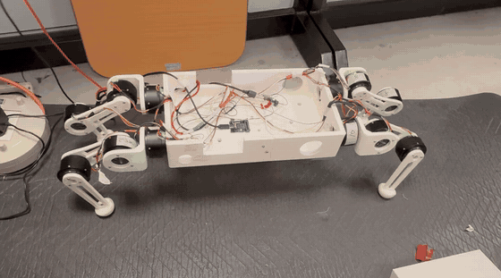

*The real robot, in torque mode, walking out across the mat — six seconds
of `trot_video/trot.MOV`, which is the whole run.*

---

## The demo, in one run

`trot_video/trot.MOV` is a single continuous run of `walk_demo.py`, and it
contains the whole stack:

| in the video | stage | what is running |
|---|---|---|
| the robot folds to a crouch | `CROUCH` | native `0xA4` **position** mode. No torque, no model |
| it stands up, slowly | `RISE` | **torque** mode. 8 s cubic ramp; the trunk is held up by forces this code computes |
| it holds, and resists a push | `HOLD` | the same loop, at a fixed height. Push it and the recovery *is* the feedback |
| it trots in place | `TROT` | the gait clock opens, diagonal pairs alternate |
| it walks out, and walks back | `TROT` + walk ledger | every landing point displaced 20 mm; `R` returns the same number of swings |

The video is tracked with **Git LFS** (136 MB). `git lfs install` before
cloning, or `git lfs pull` after, if you want it.

## Prove it works, with no robot

```bash
git clone <this repo> && cd dog5
pip install -r requirements.txt

python3 src/selftest/test_all.py
```

Thirteen suites, ~30 s, no CAN interface, no IMU, no data files. It runs the
repository's layout gates, the NumPy-vs-MuJoCo kinematics cross-check over
1024 poses, the statics model against MuJoCo inverse dynamics, and the offline
gates of every hardware runner that ships.

```bash
python3 src/dog5_description/view_dog5.py      # look at the robot in MuJoCo
```

## How it works

In the order it has to be read: the frames first, because every later bug is a
missing rotation; then the leg, then the model, then the loop, then the clock.
Every constant quoted below is the one this repository ships, and the four
chapters in [`docs/`](#chapters) are the same story at length, with the
measured numbers and the runs behind them.

### The stack, in one picture

```
                    twelve encoders            one DETA10 AHRS
                          │                          │
                          ▼                          ▼
 ┌─────────────────────────────────────────────────────────────────┐
 │  feedback_estimator.py           z from leg FK                  │
 │                                  v from the leg-odometry identity│
 │                                  roll/pitch/yaw straight from    │
 │                                  the AHRS, ω from the gyro       │
 └─────────────────────────────────────────────────────────────────┘
                          │  (z, v, C, ω)          no filter, no fused state
                          ▼
 ┌─────────────────────────────────────────────────────────────────┐
 │  1. dynamic_model.py     WRENCH        world axes,     83.3 Hz  │
 │     F = Kp(p_ref−p) + Kd(v_cmd−v) + mg ẑ                        │
 │     M = Kp(rpy_ref−rpy) + Kd(0−ω)                               │
 └─────────────────────────────────────────────────────────────────┘
                          │  w = (0, 0, F_z, M_x, M_y, M_z)
                          ▼
 ┌─────────────────────────────────────────────────────────────────┐
 │  2. force_totorque.py    ALLOCATION    world axes,     83.3 Hz  │
 │     G f = w by damped least squares, then clamp:                │
 │     unilateral → friction cone → rescale Σf_z                   │
 └─────────────────────────────────────────────────────────────────┘
                          │  four foot forces
                          ▼
 ┌─────────────────────────────────────────────────────────────────┐
 │  3. τ = −Jᵀ Cᵀ f + leg_gravity         JOINT           83.3 Hz  │
 │     …then the impedance floor kp(q_ref−q) − kd q̇        250 Hz  │
 │     …then TorqueGate: ramp, cap, 60 N·m/s slew                  │
 └─────────────────────────────────────────────────────────────────┘
                          │  twelve torques, 0xA1
                          ▼
                    CAN bus, 250 Hz per motor

 ╌╌ gait.py ╌╌ a pure function of t: which legs are in which branch ╌╌
```

Read it downwards. The trunk asks for a wrench, the feet split it, each motor
is told a torque. **Layer 3 contains no trunk feedback at all** — it is pure
transmission. The gait clock reads nothing.

[`docs/ch4_quasi_dynamic_trot.md`](docs/ch4_quasi_dynamic_trot.md) is this
picture at length, block by block, with the measured numbers.

### 1 · Coordinates: three frames, and one of them floats

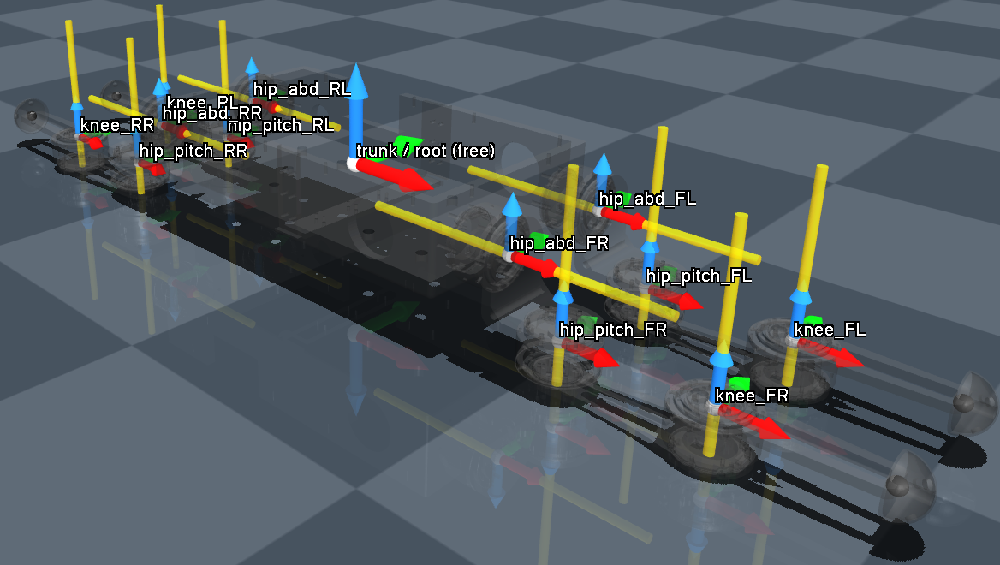

*`dog5.xml` at `q = 0`: one free root and twelve hinges. Red = x̂, green = ŷ,
blue = ẑ.*

| frame | convention | where it is |
|---|---|---|
| **World** `W` | ẑ up, gravity = −g ẑ | latched at `start()` — at that instant the world *is* the body |
| **Trunk** `B` | **FLU** — x forward, y **left**, z up | the trunk origin, 190 mm above the floor at stance |
| **Sensor** `S` | **FRD** — x forward, y **right**, z down | the DETA10 case, bolted to the trunk bottom 38 mm lower |

| the state | who supplies it |
|---|---|
| `z` | leg FK through the planted feet |
| `x`, `y` | **nobody.** Leg odometry measures velocity and has no origin |
| roll, pitch | the AHRS — and they are a *gravity* estimate, valid while the specific force is gravity |
| yaw | the AHRS too: magnetometer, next to twelve motors and a steel frame. Exposed, logged, and not trusted by default |
| `q` (12) | the encoders |
| `q̇` | encoder differencing |
| `ω` | the gyro, body frame, all three axes |

The legs are solved in `B`, the wrench is solved in `W`, and **`R_wb` is the
only thing between them**. Every frame bug this project has had was a missing
or a doubled `R_wb`.

### 2 · The IMU is not in the robot's frame

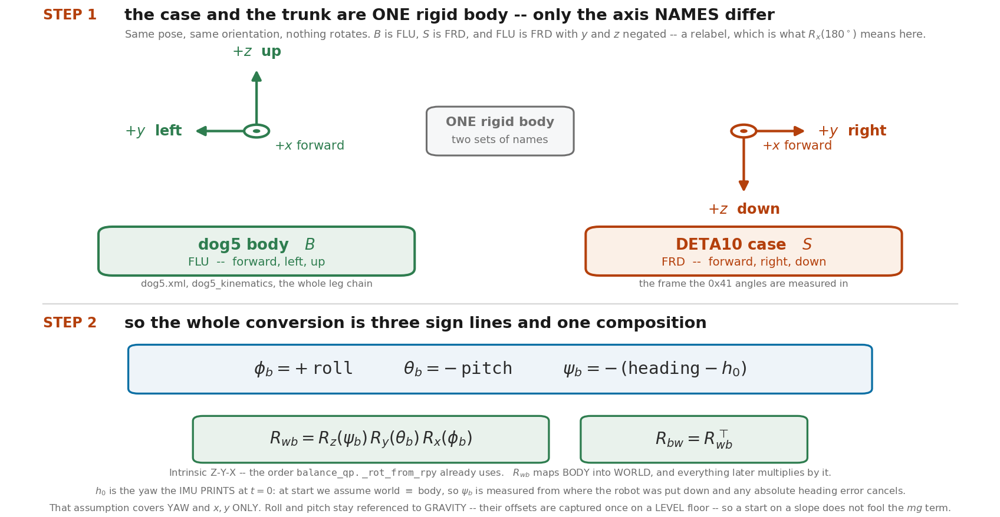

Nothing rotates in step 1: the sensor case and the trunk are **one rigid body
with two sets of axis names**, and FLU is FRD with y and z negated — the
relabelling that `R_x(180°)` means here. What is left is three sign lines and
one composition:

```
roll_b = +roll     pitch_b = −pitch     yaw_b = −(heading − h₀)
R_wb   = R_z(yaw_b) R_y(pitch_b) R_x(roll_b)        # intrinsic Z-Y-X
```

`h₀` is a **latch, not a constant**: the heading the AHRS printed when the
torque armed. Everything afterwards works in `yaw − h₀`, which is what "world
≡ body at t = 0" means in code, and why the error on the first sweep is
exactly zero. Re-arm the robot and the world frame is redefined. Mount tilt is
a separate, once-measured offset in `IMU_sensor/imu_calib.json`.

*(`imu_dog.py`'s docstring calls the sensor frame NED. Strictly the
body-fixed frame is FRD; NED is the navigation frame the heading is measured
*against*. The relabelling is the same either way.)*

### 3 · Four heights, and no two of them are the same height

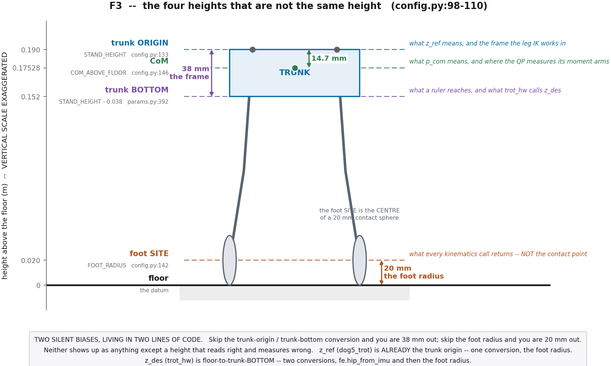

| level | value | what it is |
|---|---|---|
| trunk **origin** | 0.190 m | `config.STAND_HEIGHT`. What `z_ref` means, and the frame the leg IK works in |
| **CoM** | 0.17528 m | where the grasp map measures its moment arms |
| trunk **bottom** | 0.152 m | `params.STAND_HEIGHT`. What a ruler reaches, and what `trot_hw` calls `z_des` |
| foot **site** | 0.020 m | every kinematics call returns the **centre of a 20 mm contact sphere**, not the contact point |

Two silent biases live in two lines of code. Skip the trunk-origin/trunk-bottom
conversion and you are 38 mm out; skip the foot radius and you are 20 mm out.
Neither shows up as anything except a height that reads right and measures
wrong.

### 4 · Forward kinematics: twelve angles, four feet

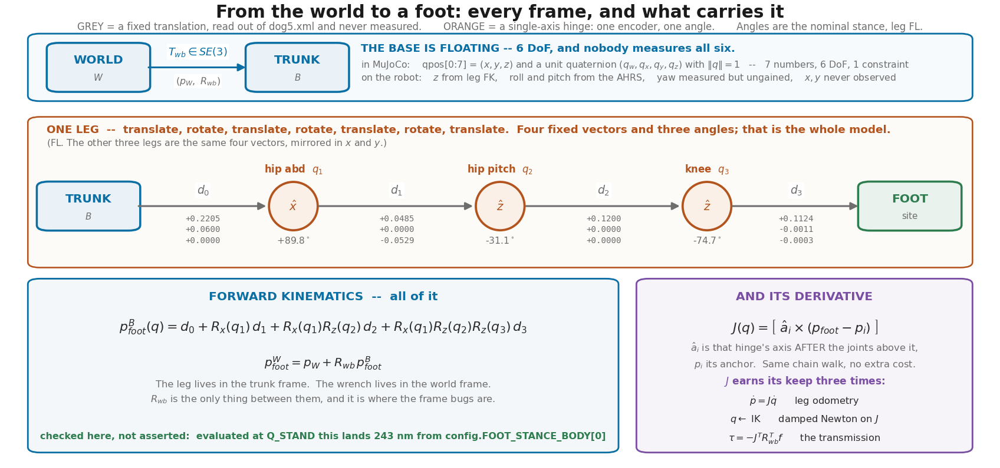

Per leg: **four fixed translations out of `dog5.xml` and three hinge angles**,
alternating. That is the whole model — no D–H table, no L1/L2/L3.

```
p_foot(q) = d₀ + Rx(q₁)d₁ + Rx(q₁)Rz(q₂)d₂ + Rx(q₁)Rz(q₂)Rz(q₃)d₃     (trunk frame)
p_foot^W  = p_W + R_wb · p_foot(q)

FL:  d₀ = (0.2205, 0.0600, 0)      d₁ = (0.04848, 0, −0.05286)
     d₂ = (0.1200, 0, 0)           d₃ = (0.11240, −0.0011, −0.0003)
```

The Jacobian is the same chain walk: column `i` is **that hinge's axis, after
the joints above it have turned, crossed into the lever to the foot** —
`J[:,i] = â_i × (p_foot − p_i)`. Three joints, three columns, so one leg's `J`
is `3×3`, and it earns its keep three times: `ṗ = J q̇` is the leg odometry,
`J` is what the IK descends, and `τ = −Jᵀ Cᵀ f` is the transmission.

**Why not D–H.** D–H buys four numbers per link by *forcing* where the frames
go — ẑ on the joint axis, x̂ on the common normal — and here there is no clean
common normal: abduction is x̂ while hip pitch and knee are ẑ of
*already-rotated* frames, and `d₁` has both an x and a z part. Forcing it means
inventing intermediate frames that match nothing on the CAD, to buy a
closed-form IK this robot never uses. The URDF/MJCF convention — a fixed
translation plus an axis, straight out of the XML — is strictly more general,
and every number in it is measurable. `check_dog5_kinematics.py` holds the
result against MuJoCo's own FK and Jacobian: **1.665e-16 m** over 1024 poses.

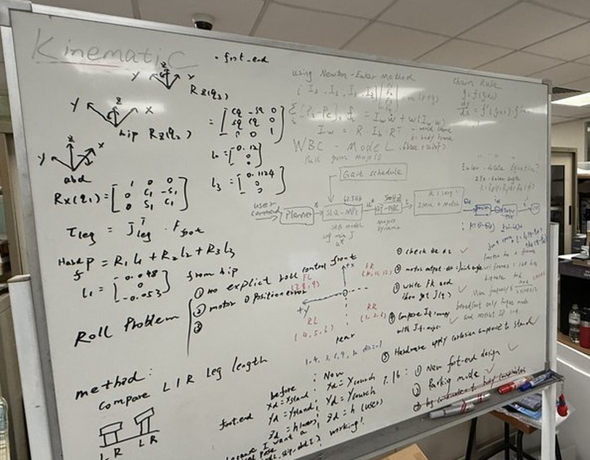

*The same chain before any of it was code: `Rx(q₁)`, `Rz(q₂)`, `Rz(q₃)`,
`l₁ = (0.048, 0, −0.053)`, `l₃ = (0.1124, …)`, `p = R₁l₁ + R₂l₂ + R₃l₃`, and
`τ_leg = J_legᵀ f_foot`.*

### 5 · Inverse kinematics: a damped Newton, warm-started

There is no closed form and no joint trajectory. The foot target is the
Cartesian goal and `q_ref` is the unknown, re-solved every model block:

```
q ← q + Jᵀ (J Jᵀ + λ²I)⁻¹ e,        e = p_target − p_foot(q)
```

One leg at a time, so `J` is the 3×3 leg Jacobian, and the loop is capped at
eight iterations. **Both halves are load-bearing.** *Damped*, because at this
stance hip-to-foot is **92.3 %** of the leg's reach and `J` is ill-conditioned
there: a plain Newton step taken from the crouch straight to the stand height
overshoots by 330 mm and leaves the workspace entirely. *Warm-started*, because
at 83 Hz across an 8 s rise each call moves the target only **0.25 mm**, so the
previous answer is already almost this one — the damping is what makes the
first call after a stage change safe anyway.

`q_ref` is therefore a pose re-solved every model block, not a joint trajectory
played back.

### 6 · The wrench layer: one rigid body, and the loop around it

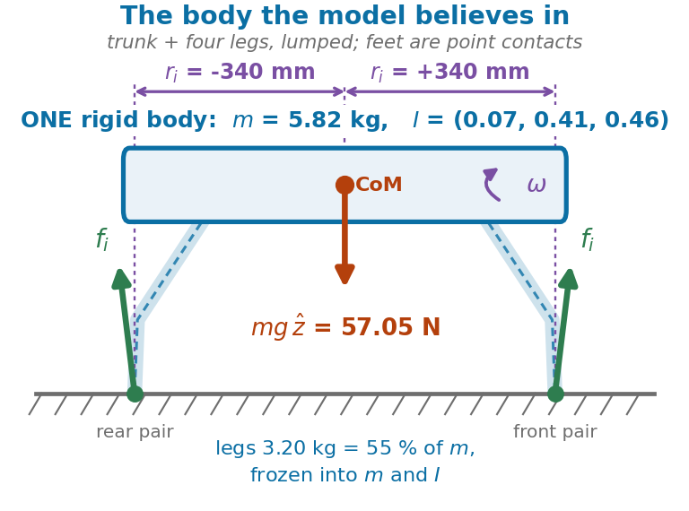

There are no motors at this layer. It sees **one rigid body** — trunk and all
four legs lumped into `m` and `I` — pushed by four contact forces, and
Newton–Euler about the CoM is the entire model:

```
m p̈ = Σ fᵢ − m g ẑ            I ω̇ + ω × (I ω) = Σ rᵢ × fᵢ
```

**Quasi-dynamic** means sending the acceleration terms to zero. What is left is
`Σ fᵢ = m g ẑ`, `Σ rᵢ × fᵢ = 0` — pure statics, an algebraic map with no state.
That map is an *actuator*, not a plant; the plant is the same rigid body with
`mg` cancelled, which is a **double integrator** per axis with no restoring
term anywhere. So a loop has to be closed around it, and choosing that loop is
the whole layer:

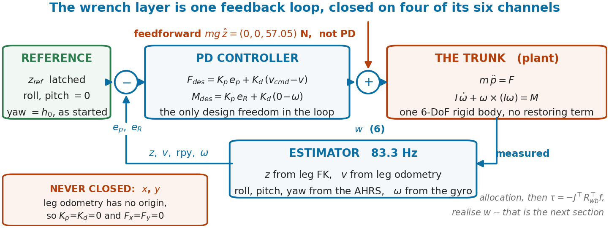

```
F_des = Kp(p_ref − p) + Kd(v_cmd − v) + (0, 0, m g)
M_des = Kp(rpy_ref − rpy) + Kd(0 − ω)
```

- **`mg` is feedforward, not PD.** A robot sitting exactly at `z_ref` has zero
  error, so a pure PD commands zero force — and it falls. The PD only trims
  about the operating point, which is also what makes the plant above clean.
- **As the trot ships** (`config.gains()`): `kp_z` 300 N/m, `kd_z` 40 N·s/m,
  and 3 N·m/rad with 0.5 N·m·s/rad on roll, pitch and yaw. The stand carries
  its own set in `torque_stand/params.py`.
- **`x` and `y` carry no gain at all** — zero stiffness *and* zero damping.
  You cannot be stiff to a coordinate nothing observes. What goes downstream is
  `w = (0, 0, F_z, M_x, M_y, M_z)`: four live rows out of six.
- **The yaw spring is opt-in three times over** — a `yaw_ref` the runner
  latches, a heading in the state, and a non-zero `kp_yaw`. Short of all three,
  yaw is damping only, and every older run is unchanged bit for bit.

### 7 · Force allocation: six equations, twelve unknowns

```
        ⎡   I      I      I      I   ⎤            f = (f₀, f₁, f₂, f₃)   (12,)
G  =    ⎣ [r₀]×  [r₁]×  [r₂]×  [r₃]× ⎦            w = (F_des, M_des)     (6,)

G f = w     top three rows:  the four foot forces must SUM to F_des
            bottom three:    their moments about the CoM must sum to M_des
            rᵢ is measured from the CoM, NOT from the trunk origin
```

Three separate problems, in one equation. Four feet down: rank 6, so the null
space is six-dimensional — internal squeeze between feet that produces zero net
wrench, and `Gf = w` has no opinion about it. A diagonal pair down: the two
contacts and the CoM are nearly collinear, so the moment about that line is
unreachable and `G Gᵀ` is singular. And the physics is not an equation at all:
the floor only pushes, and friction bounds the tangential force.

**As built** — `torque_stand/force_totorque.py`, and it is a solve with clamps,
not a QP:

1. a **weighted minimum-norm** solve, `f = diag(c) Gᵀ (G diag(c) Gᵀ + λI)⁻¹ w`.
   `λI` is what makes the rank-deficient diagonal stance return the achievable
   part instead of blowing up; `c` is the gait's `contact_weight`, so a foot
   entering stance ramps its share up instead of taking a quarter of the robot
   in one model block.
2. per foot, **unilateral** then **friction**: `f_z ≥ 1 N`, then
   `‖f_xy‖ ≤ μ f_z` with `μ = 0.6` — the exact circle, because a clamp can
   afford what a linear QP row cannot.
3. **rescale the stack back to the commanded `F_z`.** The unilateral clamp only
   ever *raises* `f_z`, so left alone it is not a saturation but a runaway:
   before this step, 10° of roll commanded 122 N of support on a 57 N robot.

A cone-constrained QP was written for this robot and is **not** in this
repository, because it never ran in the loop — see [what is not
here](#what-is-not-here).

### 8 · Statics to joint torque, and the minus sign is not optional

From virtual work, with an external force at the foot:

```
f · J δq + τ · δq = 0     ⟹     τ = −Jᵀ f          then  τᵢ = −Jᵢᵀ Cᵀ fᵢ
```

`f` is the **ground reaction** — the force the *floor* applies — which is what
the allocator solves for, and why `Gf` sums to `+mg`. Writing `+Jᵀf` is a robot
that answers "push up" by driving its feet into the floor. `Cᵀ` is there
because the allocator works in world axes while `J` is a trunk-frame Jacobian,
and virtual work needs both in the same frame.

Then **leg gravity, on both branches**. `−Jᵀf` alone models a *massless* leg,
and this robot's legs are 55 % of its mass: against MuJoCo's floating-base
inverse dynamics, `−Jᵀf` alone is off by **0.482 N·m** and matches to machine
precision once the term is added. A stance leg needs it because the
transmission omits it; a swing leg needs it because nothing else holds the limb
up at all.

**This layer contains no trunk feedback whatsoever.** It is pure transmission.

### 9 · Rates, and what is held between them

250 Hz per motor — 333 µs per CAN slot, against a 50 ms driver input-lost
watchdog. Everything expensive runs **one sweep in three**:

| runs at | what |
|---|---|
| **250 Hz**, every sweep | the joint floor: `kp(q_ref − q) − kd q̇`, then `TorqueGate` — ramp, 3.0 N·m cap, 60 N·m/s slew — and out over CAN in torque mode |
| **83.3 Hz**, 1 sweep in 3 | the model block: estimator → wrench → allocation → IK. Its feedforward is *held* across the other two |
| **20.8 Hz**, 1 sweep in 12 | the measured-current foot-load check, offset by one sweep so it never lands on a model sweep — `trot_hw --self-test` asserts the non-collision for all 36 phases |

Only the feedforward is held. The damper is never sub-sampled: it is computed
against encoder values at most 4 ms old, because sub-sampling it would cost
stability and not just resolution.

### 10 · The trot: a clock, and an arc

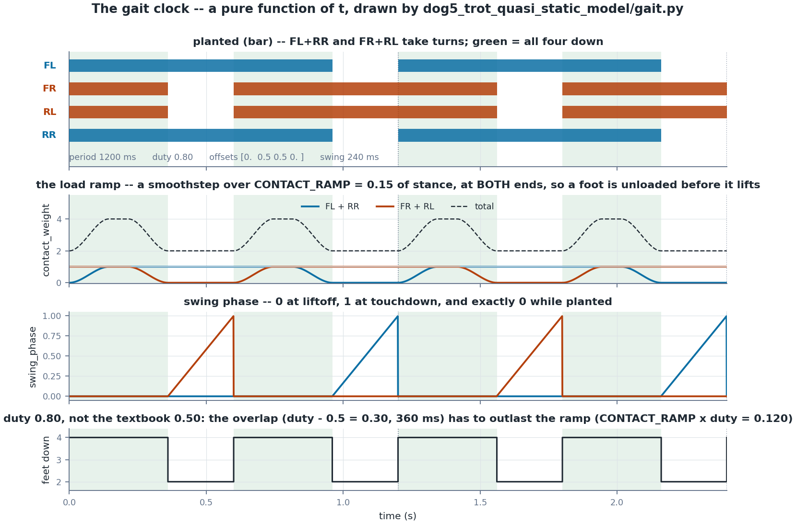

A gait is nothing more than which feet are on the ground, and when — and the
schedule is driven **by time alone**: `φᵢ = (t/T + Δᵢ) mod 1`, stance while
`φᵢ < duty`. The clock never reads the robot. Ask it at time `t` and it answers
the same thing every time.

`contact_weight` is that same clock once more: a smoothstep in phase that
reaches the allocator as that foot's *share* of the load. The ramp lives
**inside** stance, not straddling the lift, so a foot is already unloaded by the
time the schedule lifts it — which is what makes liftoff free. Nothing measures
load; the schedule says what a foot is *allowed* to carry and the solve hands
the rest to the others. That is also why duty is 0.80 and not the textbook
0.50: the four-foot overlap has to outlast the ramp.

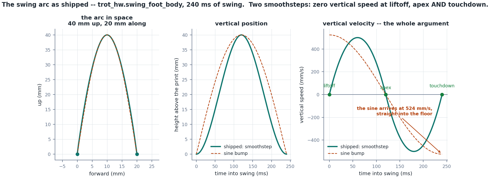

The arc is **two smoothsteps** — one over the whole swing for the horizontal,
one up-then-down for the bump — so the vertical speed is zero at liftoff, at
the apex *and* at touchdown. A sine bump, the usual shortcut, arrives at
524 mm/s straight into the floor. The horizontal is ramped for the same reason
it is not a constant offset applied at liftoff: `p_des` goes straight into a
140 N/m Cartesian impedance, and a 20 mm step there appears in one sweep, on
the leg with the least authority to absorb it.

Both figures are drawn by `docs/figs/make_figures.py`, which imports
`gait.py` and `trot_hw.swing_foot_body` and reads `config.py` — retune the gait
and re-run it, and they follow.

### 11 · Why a trot in place walks away

Two facts, and neither of them is a tuning failure:

- **The wrench does not push.** Rows `x` and `y` of `w` are identically zero:
  there is no position term on them at all, and the damper that could have sat
  there ships at `KD_POS[:2] = 0`. In the plane this layer commands nothing.
- **The feet are not placed.** The swing target's `x/y` is the crouch value *in
  the trunk frame*, so the print follows the body wherever the body has gone.

The one horizontal mechanism a quadruped has is that it **steps**, and that is
the mechanism not closed. `walk_demo.py` displaces the landing point on purpose
— `WALK_STEP_M` = 20 mm per swing, out on `T` and back on `R` — but that is an
open-loop ledger: it counts swings, it does not know where the robot is.
Closing it needs a foothold that reacts to a measured velocity (Raibert's
`v T_st/2`), and that rides on the *bias* of the velocity estimate, not its
noise. Which is the argument for an estimator, and the estimator is the thing
this repository does not have.

## Running it on the robot

```bash
sudo bash src/bringup/t1_preflight.sh              # brings can0 up at 1 Mbit/s
python3 src/bringup/t2_ping_scan.py                # do all twelve answer?

cd src
sudo HOME=$HOME chrt -f 50 python3 dog5_trot_quasi_static_model/walk_demo.py
```

Keys: `ENTER` rise · `T` trot / back to HOLD · `R` walk back · `P` park (from
HOLD only) · `SPACE` limp · `X` stop.

**Parameters are edits, not flags.** Open
`src/dog5_trot_quasi_static_model/config.py`, change the constant, save. Every
run logs itself to `run_<date>_<time>.npz`, and the log embeds
`config.snapshot()` — every constant as imported, plus `config.py`'s own source
text — so the run says what flew without anyone writing it down. The only
tuning flag left is `--tau-max`.

The full procedure, in the order it must be done, is in
[`docs/runbooks/DEMO_RUNBOOK.md`](docs/runbooks/DEMO_RUNBOOK.md).

## Repository map

```
src/
  dog5_paths.py          the ONLY sys.path logic in the repo
  motor/                 the CAN motor library: motorbus, motor_library,
                         motor_gains, mac_can
  bringup/               the T1–T8 CAN bring-up ladder. t1 brings can0 up
  motor_demos/           single-motor scripts: read a state, follow a
                         trajectory, feel an impedance
  IMU_sensor/            DETA10 driver, frame test, noise logger, imu_calib.json
  dog5_description/      THE MODEL: dog5.xml, meshes, NumPy kinematics,
                         statics, the hardware map, the MuJoCo cross-check
  calibration/           zeroing, per-leg zeroing, and the pose capture that
                         produced the recorded crouch
  robot_base/            the shared CAN/joint hardware layer, and the
                         position-mode runner the crouch comes from
  torque_stand/          THE CONTROLLER: params, crouch/park, feedback,
                         wrench, allocation, and the torque stand
  dog5_trot_quasi_static_model/   the trot: config, gait clock, and the three
                         runners (package — deliberately off sys.path)
  selftest/              the gates no single module owns, and test_all.py
  tools/                 log conversion, forensics, and the --web telemetry
docs/                    four chapters, a summary, the runbooks, the README
                         figures (images/) and the two that are generated
                         from config.py (figs/make_figures.py)
data/                    run logs — gitignored, see data/README.md
trot_video/              the demo run (Git LFS)
dog5_sdk/                the handover package — see below
```

### `dog5_sdk/` — the robot, packaged for someone else's controller

A self-contained package for handing the machine to someone who wants to run
**their own** controller on it. One `Controller.update(state) -> twelve
torques`, and the same class runs in MuJoCo (`Dog5Sim`) and on the CAN robot
(`Dog5Hardware`) with nothing changed.

It carries the motor library, the kinematics and statics, the calibrated joint
contract, the MJCF and meshes, the safety gate and the estimator — plus a
`FakeDriverBus` that answers the real protocol, so the whole CAN path can be
exercised on a laptop with no adapter.

The files it copies are copied, not re-derived: `motor/`, `kinematics.py`,
`hardware_map.py`, `params.py` and the model are byte-identical to `src/`;
`statics.py` and `estimator.py` differ only in their import header.
`dog5_sdk/tools/sync_from_repo.py` regenerates them and
`dog5_sdk/tests/test_sync.py` fails on drift.

```bash
cd dog5_sdk && pip install -e . && python tests/test_all.py
```

`src/dog5_paths.py` puts every directory under `src/` on the path, so any
script anywhere can `import motorbus`. The trot package is deliberately kept
**off** it: it contains a `config.py`, and the resulting shadowing used to kill
the CAN layer with an unrelated `AttributeError` several imports later.
`src/selftest/test_layout.py` gates against that, against a stale import
anywhere in the tree, and against a file nothing reaches.

### Modules used by more than one chapter

Chapter identity lives in `docs/`, not in the directory names, because several
modules genuinely belong to several chapters.

| module | home | used by |
|---|---|---|
| `motor/motorbus.py` | ch1 | 1, 4 |
| `IMU_sensor/imu_dog.py` | ch2 | 2, 4 |
| `dog5_description/dog5_kinematics.py` | ch3 | 3, 4 |
| `dog5_description/dog5_statics.py` | ch3 | 3, 4 |
| `robot_base/stand_dog5_hw.py` | ch3 | 3, 4 |

## Chapters

| # | chapter | claim | status |
|---|---|---|---|
| 1 | [Motor library](docs/ch1_motor_library.md) | 12 motors on one CAN bus at 250 Hz **per motor**, recovery with no power cycle | **PASSED** |
| 2 | [IMU sensor](docs/ch2_imu_sensor.md) | ~200 Hz, 0 CRC errors, 0.01–0.03° jitter under motor load | **PASSED** |
| 3 | [Kinematics & calibration](docs/ch3_kinematics_and_calibration.md) | NumPy FK/Jacobian agree with MuJoCo to 1.665e-16 m | **PASSED** |
| 4 | [Quasi-dynamic trot](docs/ch4_quasi_dynamic_trot.md) | Torque stand works and is repeatable; the trot runs and drifts | **PARTIAL** |

A one-page version: **[docs/SUMMARY.md](docs/SUMMARY.md)**.

## What is not here

Three substantial bodies of code were written for this robot and are **not** in
this repository, because none of them has ever been in the control loop. They
live in the private `dog_stand_compliance_control` history at tag
`pre-public-reorg-2026-08-26`.

| what | why it is not here |
|---|---|
| **An error-state (Bloesch) EKF** — quaternion attitude, IMU bias tracking, contact-constrained velocity, plus a read-only worker, a replay harness and acceptance gates | It has never run in the loop. The shipped feedback is the direct chain: AHRS attitude, FK height, algebraic leg odometry. §5 of chapter 4 is what actually runs |
| **A cone-constrained force-distribution QP** and a `TrotController` around it — SO(3) log-map attitude error, weighted wrench residual, contact-weight bounds, world-frame Raibert swing | The QP was instantiated only inside its own self-test. What flies is damped least squares plus clamps — chapter 4 §6 |
| **A convex MPC** over the single-rigid-body model | Ported, runs offline, never validated on hardware and never gated |

Also removed: the position-mode stand-and-crawl track (hardware-verified July
2026, but nothing in the trot chain imports it), the July torque primitives
that `torque_stand/` superseded, and the Virtual Model Control track whose
simulation passed and whose hardware runner did not.

This is stated plainly because the alternative — shipping the sophisticated
version and letting a reader assume it is what runs — is the more misleading
choice. The interesting result here is what a quasi-static model with no
estimator actually does on a real robot, and that needs the real code.

## Hardware and environment

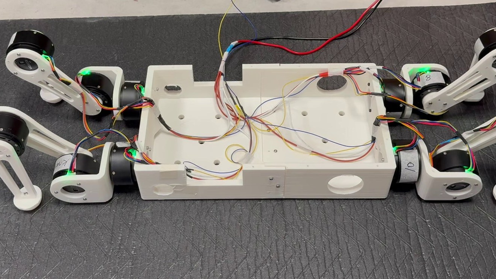

- 12 × LK / K-TECH brushless servo drivers, CAN IDs 1–12, 10:1 reduction
- SocketCAN `can0` at 1 Mbit/s (`src/bringup/t1_preflight.sh` brings it up)
- 1 × FDILink DETA10 AHRS on the trunk
- Robot mass 5.8151 kg, of which the legs are 3.196 kg — **55 %**
- A Pi-class Linux host running the control loop at 250 Hz per motor

**`fdilink_imu`, the IMU vendor SDK, is not on PyPI and is not vendored here.**
Install it on the robot host at `~/Documents/IMU_sensor/fdilink_imu`. Without
it everything still imports and every offline gate still passes; only opening a
real IMU fails. See [chapter 2](docs/ch2_imu_sensor.md) §7.

MuJoCo is a **hard** dependency, not an optional simulation extra — the
hardware stack imports it transitively for FK and Jacobians.

## Safety

Every `*_hw.py` moves a 5.8 kg machine with twelve motors that can bite.

- Run `--self-test` first. Every runner has one, and it needs no hardware.
- Follow the runbooks: [demo](docs/runbooks/DEMO_RUNBOOK.md),
  [stand](docs/runbooks/DOG5_STAND_RUNBOOK.md).
- Start suspended, then use the torque ladder on the floor. `TAU_START_MAX` is
  1.0 N·m for a reason.

**The trips are not a safety net you can lean on.** Chapter 4 §9 documents a
run where the tilt trip did not fire, the robot ended up on its belly at 2.4×
body weight, **and read perfectly level while doing so** — because a robot
lying flat is level. Know what each gate can and cannot see.

## Provenance

Assembled from two private repositories, both tagged
`pre-public-reorg-2026-08-26`:

- `can_motor_control` — the CAN/motor layer
- `dog_stand_compliance_control` — everything robot-level, embedded in the
  first as a gitlink with no `.gitmodules`, so cloning the parent produced an
  empty directory

## Citation

> Zhan Zhi, *DOG5: a quadruped from CAN bus to quasi-dynamic gait*, Nanyang
> Technological University, 2026. https://github.com/snowyfoams/dog5

## Licence

[MIT](LICENSE). The IMU vendor SDK and the Fusion→MJCF exporter are
third-party and are not included; see the notices at the foot of `LICENSE`.
